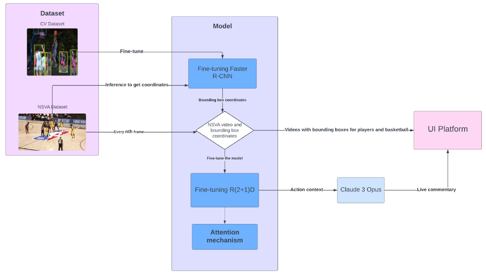
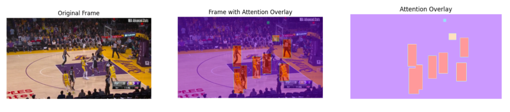
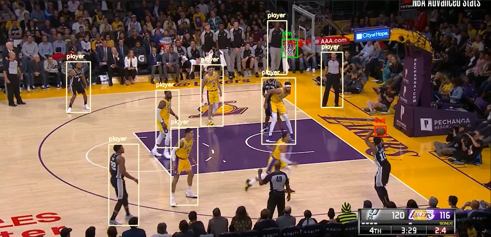

# NBA Play Recognition
*Aidana Imangozhina*<sup>1*</sup>, 
*Shree Phadke*<sup>1*</sup>, 
*Scottie Williamson*<sup>1*</sup>, 

<sup>1</sup>Columbia University &nbsp;&nbsp;

<span>*</span> Equal Contribution - to see the timeline, refer to the **Meeting Progress and Code Timeline PDF**.

 ## Approach outline
 <div align="center">
</img>
</div>
 Our approach relies on first extracting positional features using a finetuned Fastrcnn object detector. The model is finetuned to detecting 3 classes of objects: player, basket, and ball. Using those detections an attention map is created for each frame. The attention map has varying intensities for each class of object with the ball, and basket receiving the most emphasis. This attention map and video frames are then fed into a pre-trained R(2+1)D cnn for finetuning. 
 <div align="center">
</img>
</div>

 ## Detection Demo
Access demo footage of our finetuned detection model by clicking the image below.
[](https://youtu.be/TV_bLXzXce8?si=pvAcY3qM2YwcDHZ5 )

## Video downloading tools
To download the raw mp4 files from NBA.com use the video collector tool
```
cd nsva_data
cd NSVA_project
cd tools
python collect_videos.py
```
Files download to .pbp_video folder. 
Download tools taked from [Sports Video Analysis on Large-Scale Data](https://github.com/jackwu502/NSVA)

## Model Training
To train the model run
```
python training.py
```


